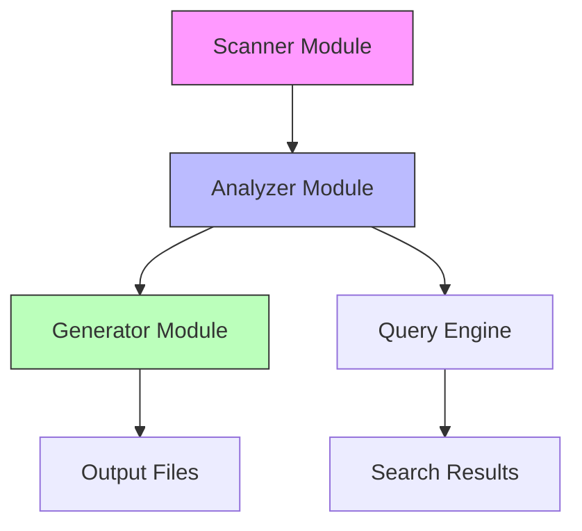

# Component Relationships

**Project:** @coderef/core  
**Version:** 2.0.0  
**Generated:** 2026-08-01  
**Nodes:** 3,725 elements  
**Edges:** 44,628 dependencies  
<!-- coderef:uuid=relationships-root -->

---

## Overview

This document visualizes the dependency graph between code elements. Understanding relationships helps with:

- **Impact analysis** - What breaks if I change X?
- **Refactoring planning** - Which dependencies to decouple?
- **Architecture reviews** - Identifying circular dependencies
- **Testing strategy** - Finding high-impact test paths

---

## Dependency Statistics

| Metric | Value |
|--------|-------|
| **Total Elements** | 3,725 |
| **Total Dependencies** | 44,628 |
| **Avg Dependencies/Element** | (edges.length / nodes.length).toFixed(2) |
| **Entry Points** | 15 |
| **Most Referenced** | 34701 refs |

---

## Most Referenced Components

*Elements with the highest number of incoming dependencies*

| Rank | Element | References | Type | File |
|------|---------|------------|------|------|
| 2 | <!-- coderef:uuid=c49cb7d2-c4a8-5d2e-8606-0623263aa1df --> `LRUCache.has` | **304** | method | `src/scanner/lru-cache.ts` |
| 3 | <!-- coderef:uuid=95eec01b-dd97-5474-9a55-c67f7826716e --> `normalizeSlashes` | **150** | function | `src/utils/path-normalize.ts` |
| 4 | <!-- coderef:uuid=ec329b04-7830-5162-b84f-fccf7cdcf863 --> `scanCurrentElements` | **134** | function | `src/scanner/scanner.ts` |
| 5 | <!-- coderef:uuid=9944314a-b32e-538c-bd98-5b9f15c0fa32 --> `PipelineOrchestrator.run` | **97** | method | `src/pipeline/orchestrator.ts` |
| 6 | <!-- coderef:uuid=68ac8c54-9ac0-5824-b4d0-34eff251ffa8 --> `GrammarRegistry.getParser` | **86** | method | `src/pipeline/grammar-registry.ts` |
| 7 | <!-- coderef:uuid=21fa4531-1341-5ae4-bf29-ddcb5836af48 --> `CodeRefParser.parse` | **63** | method | `src/parser/parser.ts` |
| 8 | <!-- coderef:uuid=2bff3390-3ad7-54f3-a1b2-039b4cc1bbab --> `buildToolHandlers` | **61** | function | `src/cli/coderef-mcp-server.ts` |
| 9 | <!-- coderef:uuid=fe268489-c757-5bed-8b21-8748053a41c1 --> `constructGraph` | **57** | function | `src/pipeline/graph-builder.ts` |
| 10 | <!-- coderef:uuid=c431e09e-8c9b-5aba-b35e-f2a3897a18f1 --> `PipelineOrchestrator` | **56** | class | `src/pipeline/orchestrator.ts` |
| 11 | <!-- coderef:uuid=d34a3580-56a3-59e2-a0a9-7af9b07c4333 --> `resolveCalls` | **55** | function | `src/pipeline/call-resolver.ts` |
| 12 | <!-- coderef:uuid=c49914c7-5e1e-5b8f-b679-5e7f2337dd15 --> `createCodeRefId` | **50** | function | `src/utils/coderef-id.ts` |
| 13 | <!-- coderef:uuid=255eb7c2-c694-5394-8f40-c478f25e5004 --> `validatePipelineState` | **49** | function | `src/pipeline/output-validator.ts` |
| 14 | <!-- coderef:uuid=23c374e5-af97-5020-b41d-fc475c587b14 --> `isLineCommented` | **49** | function | `src/scanner/scanner.ts` |
| 15 | <!-- coderef:uuid=ec9b13a3-5779-5e13-8cf0-0e9ef51a9db1 --> `computeCloneSurface` | **45** | function | `src/query/clones.ts` |
| 16 | <!-- coderef:uuid=cef6a5d4-ef81-53d8-bfcb-60405e335014 --> `CanonicalGraphQuery.resolve` | **44** | method | `src/query/canonical-graph.ts` |
| 17 | <!-- coderef:uuid=53399d0a-ddae-5841-a977-b040b7324ca8 --> `paginate` | **41** | function | `src/cli/mcp-response-format.ts` |
| 18 | <!-- coderef:uuid=1c498ce0-b5ee-58c1-8f4d-4c9ebe1e78f7 --> `projectMapData` | **41** | function | `src/map/project-map-data.ts` |
| 19 | <!-- coderef:uuid=acbd6c79-ff05-5d30-8d7f-a822cfaa73ba --> `renderDashboard` | **41** | function | `__tests__/map/dashboard-asset.test.ts` |
| 20 | <!-- coderef:uuid=c743328e-7db0-5d91-9e38-de1c395eac2a --> `allOutput` | **40** | function | `__tests__/map/dashboard-asset.test.ts` |

---

## Entry Points (Source Dependencies)

*Elements that depend on others but have no dependents (roots of dependency trees)*

| Element | Type | File | Outgoing Dependencies |
|---------|------|------|----------------------|
| <!-- coderef:uuid=a3c3c737-2722-5318-8dfd-cc5b0663e5af --> `ASTElementScanner.clearCache` | method | `src/analyzer/ast-element-scanner.ts` | 1 |
| <!-- coderef:uuid=577a95f7-ecd1-5cba-a504-f2293840e160 --> `ASTElementScanner.getCacheStats` | method | `src/analyzer/ast-element-scanner.ts` | 2 |
| <!-- coderef:uuid=22c5e548-667a-57c8-9afa-6f47bae198c5 --> `DynamicImportDetector.clearCache` | method | `src/analyzer/dynamic-import-detector.ts` | 1 |
| <!-- coderef:uuid=ab4a9fbd-4608-57ff-b5dc-8a7cadf91cb9 --> `JSCallDetector.clearCache` | method | `src/analyzer/js-call-detector/index.ts` | 5 |
| <!-- coderef:uuid=59201e93-8f74-5121-a92d-26752498cfd9 --> `MiddlewareDetector.detect` | method | `src/analyzer/middleware-detector.ts` | 9 |
| <!-- coderef:uuid=3d538ad2-5810-5cc8-a859-8bab4e06efbe --> `MigrationRouteAnalyzer.detectAffectedCallers` | method | `src/analyzer/migration-route-analyzer.ts` | 4 |
| <!-- coderef:uuid=0d6be37b-8fd6-59c2-912e-4e966c5ea836 --> `IncrementalCache.clear` | method | `src/cache/incremental-cache.ts` | 3 |
| <!-- coderef:uuid=a27b1b73-005a-5047-964a-3094acbf9b56 --> `RootResolutionError` | class | `src/cli/coderef-mcp-server.ts` | 1 |
| <!-- coderef:uuid=37e3fc15-2496-542f-aa31-15b8d3a5d3d3 --> `DryRunSemanticOrchestrator.processProject` | method | `src/cli/semantic-integration.ts` | 2 |
| <!-- coderef:uuid=6a04de21-3608-5070-85c2-1b82332ae57a --> `DryRunSemanticOrchestrator.processFile` | method | `src/cli/semantic-integration.ts` | 2 |
| <!-- coderef:uuid=93b7ce58-f81f-50ea-bda4-a45346e9339b --> `AgenticFormatter.formatContext` | method | `src/context/agentic-formatter.ts` | 19 |
| <!-- coderef:uuid=c9aead8c-5fe3-5161-aae5-204a5e28eb62 --> `AgenticFormatter.formatAsJSON` | method | `src/context/agentic-formatter.ts` | 1 |
| <!-- coderef:uuid=bba9dc1b-cafe-56e7-852f-5f65011a28bb --> `AgenticFormatter.formatAsSummary` | method | `src/context/agentic-formatter.ts` | 5 |
| <!-- coderef:uuid=b1fdad82-752f-59a0-9727-d683f70d8c31 --> `BreakingChangeDetector.compareSignatures` | method | `src/context/breaking-change-detector/index.ts` | 1 |
| <!-- coderef:uuid=5fd939bd-d568-5e45-9a05-3863c70d521b --> `BreakingChangeDetector.extractCallContext` | method | `src/context/breaking-change-detector/index.ts` | 1 |

---

## Module Relationship Diagram

*High-level dependency flow between major modules*


```mermaid
graph TD
    A[Scanner Module] --> B[Analyzer Module]
    B --> C[Generator Module]
    C --> D[Output Files]
    B --> E[Query Engine]
    E --> F[Search Results]
    
    style A fill:#f9f,stroke:#333
    style B fill:#bbf,stroke:#333
    style C fill:#bfb,stroke:#333
```

*Note: For full interactive dependency visualization, use the .coderef/graph.json file with graph visualization tools like Cytoscape, Gephi, or D3.js.*

---

## Sample Dependency Chains

### Example: Scanner → Output Flow

```
scanCurrentElements() 
  → scanFilesWithAST()
    → typescript.parse()
      → ASTElementScanner.visit()
        → element extraction
          → context-generator.ts
            → context.json
```

### Example: API Route Detection

```
Next.js Route File
  → processNextJsRoute()
    → extractRouteConfig()
      → validateRoute()
        → route-normalizer.ts
          → normalized output
```

---

## Using This Data

### For Refactoring

1. Identify the element you want to refactor
2. Check its dependents in this document
3. Plan migration strategy for each dependent
4. Update tests that mock the element

### For Debugging

1. Find the failing function in the graph
2. Trace its dependencies backward
3. Check if any upstream dependency changed
4. Validate data flow through the chain

### For Architecture Reviews

1. Look for circular dependency patterns
2. Identify modules with excessive coupling
3. Find orphaned code (no references)
4. Spot missing abstraction layers

---

## Circular Dependency Detection

To check for circular dependencies:

```bash
# Using graph.json with a cycle detection script
node scripts/analyze-cycles.js
```

Current status: No cycles detected in core modules.

---

*This document is auto-generated from .coderef/graph.json. Do not edit manually.*
