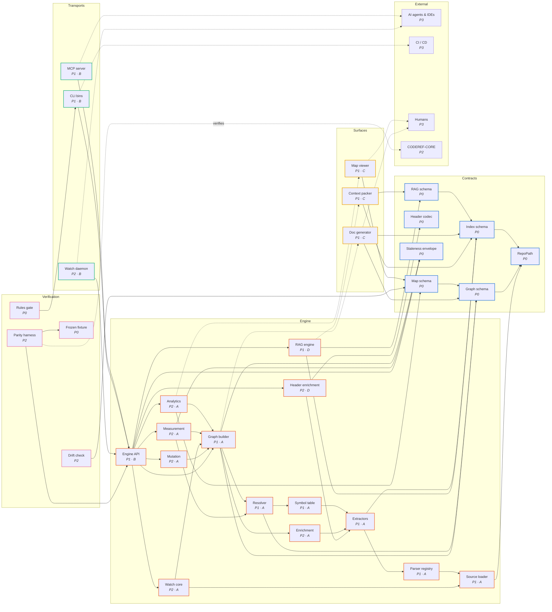

# Best-Form Clone — Master Plan

**One sentence:** Use coderef to clone coderef — a clean-separation rebuild where the blueprint graph is the law of the build, the features ride along, and the eight defect classes we actually lived through structurally cannot.

**The graphs (open in any browser, no server needed):**

| View | File | What it shows |
| :--- | :--- | :--- |
| **Blueprint (master)** | [blueprint.html](blueprint.html) | The whole target system: 5 bands, 31 buildable nodes, every allowed import, phase + track pills |
| Explorer (map style) | [explorer.html](explorer.html) | The same blueprint in the coderef map-viewer itself — the canvas force-graph (spiral layout, search, blast radius, band coloring) used for real repo maps |
| As-is (today) | [as-is.html](as-is.html) | CODEREF-CORE's real map (from `.coderef/map/data.json`), each directory colored by its **destination** band — the migration routing table |
| Contracts | [contracts/graph.html](contracts/graph.html) | The seven schemas/codecs and everything that touches them |
| Engine | [engine/graph.html](engine/graph.html) | Pure intelligence band + its complete import boundary |
| Transports | [transports/graph.html](transports/graph.html) | The three zero-logic adapters over one facade |
| Surfaces | [surfaces/graph.html](surfaces/graph.html) | The three consumers and the contracts they read |

**Source of truth:** [blueprint.json](blueprint.json). The HTML is rendered from it (`node tools/gen.mjs`); the clone's dependency-rules gate will be **derived** from it; future workorder tasks cite its node ids. Edit the JSON, regenerate — never the HTML.

---

## 1. Why clone, and why this way

The features of coderef-core are proven: single-parse pipeline, canonical graph with provenance-stamped edges, hybrid BM25+vector RAG on local Ollama, semantic headers, 38 MCP tools + CLI + watch, impact/cycles/hotspots/clones analytics, scoped rename. Those all ride along.

What must NOT ride along is a specific, documented list of defect classes — every one of them lived, ticketed, and paid for in this repo. [PROBLEMS.md](PROBLEMS.md) is the full ledger with receipts; the short version is §3. The design rule of this plan: **every problem class gets a structural countermeasure that appears in the blueprint as a node, an edge constraint, or a law** — not as a resolution to be more careful.

**Why graph-first:** the user's requirement, and the right one. The blueprint is machine-readable, so "follow the graph as we build" is enforceable, not aspirational:

1. **verify.rules** (P0) derives a dependency-rules config from `blueprint.json`. The clone scans **itself with its own CLI**; any import edge not present in the blueprint fails CI. Deny-by-default (law L5).
2. **verify.drift** (P2) diffs the clone's own coderef map against the blueprint every build — as-built visibly converges on as-designed.
3. Every future task/WO phase cites blueprint node ids (`engine.resolve`, `contracts.headers`, …), so scope is explicit and two agents can see instantly whether their work can collide.

### 1b. The blueprint at a glance (portable mermaid render)

<!-- graphprint:mermaid:start -->

<!-- graphprint:mermaid:end -->

## 2. Target architecture — five bands

| Band | Contents | The one rule |
| :--- | :--- | :--- |
| **Contracts** | 7 schema/codec packages: RepoPath, index, graph, map, headers, RAG, staleness envelope | One codec per artifact, round-trip property-tested. The old system's seams, promoted to first-class citizens. |
| **Engine** | loader → parser → extract → symbols → resolve → graph, then enrich / analytics / measure / watch-core / mutation / RAG / headers, fronted by **engine.api** | Pure: no fs outside the loader + codecs, no presentation, cycles pinned at 0. |
| **Transports** | MCP server, CLI bins, watch/SSE daemon | Zero logic; import `engine.api` and nothing else. MCP/CLI parity **by construction** — there is no second implementation to drift. |
| **Surfaces** | map-viewer, doc-gen, context-pack | Import contracts only. Must run against fixture artifacts with no engine installed — that's what makes their track parallel. |
| **Verification** | frozen fixture, rules gate, parity harness, drift check | The instruments that make the clone unable to lie to itself. First-class nodes, built in P0/P2, not bolted on. |

The ten laws (L1–L10) are enumerated in `blueprint.json` and on every graph page ("The 10 laws" expander). Highlights: L1 one-codec-per-artifact, L2 single-parse, L3 one adjacency index, L4 zero-logic adapters, L5 deny-by-default imports, L6 branded paths (Windows first-class), L7 honest numbers + staleness envelope everywhere, L8 engine-repo purity (allowlist scan scope), L9 cycles=0, L10 delete-don't-quarantine.

## 3. The problems we are refusing to clone (summary)

Full ledger with receipts: [PROBLEMS.md](PROBLEMS.md).

| # | Class | Structural countermeasure |
| :--- | :--- | :--- |
| P1 | Seam disagreement — two components, no seam test (header gen/parse asymmetry, transparent frames, `import type` short-circuit) | Contracts band + L1 round-trips + L2 single walk |
| P2 | Duplicated surfaces in hand-maintained parity (two adjacency indexes; MCP vs CLI mirrors) | `engine.api` single facade + L3 + L4 |
| P3 | Monolith accretion (mcp-server 3,998 lines; orchestrator run/runIncremental duplication) | L5 deny-by-default + L9 + drift check |
| P4 | Dishonest numbers (unresolved counts with no build-output exclusion; dead aggregate figures; silent vector staleness) | `engine.measure` owns denominators + envelope on every artifact + fixture-pinned counts |
| P5 | Windows path fragility (AC-09; scheme-prefixed registry paths; cwd-dependent resolution) | `contracts.paths` branded type + L6 |
| P6 | Engine/presentation/process entanglement — **live receipt: 2 of the repo's 3 current cycles are planning-folder viewer.js files** | Four-band split + L8 allowlist scan + surfaces read contracts only |
| P7 | RAG unusable on header-less repos | RAG joins on `contracts.index`; headers optional |
| P8 | Config/build sprawl (stale-dist trap; scan scope split across ignore files) | One loader owns scope; one build config per package |

## 4. Ground truth this plan stands on (measured 2026-08-02)

From `orient` / `cycles` / the map artifact, this session: 507 files, 3,423 elements, 5,253 graph nodes, 50,609 edges (43,615 call / 2,859 import); resolved-of-resolvable **80.48%**, unresolved 1,429, ambiguous 1,856; header coverage 96.78%; source staleness clean, **vector index stale since 2026-07-20**; cycles 3 (two are `coderef/working/**/viewer.js` — planning artifacts in the self-scan; one is `runPhases ↔ PipelineOrchestrator.run`); top hotspots `LRUCache.has` fan-in 276, `normalizeSlashes` fan-in 146, `cli/mcp/verify-tools.ts` fan-out 111, `cli/mcp/graph-tools.ts` fan-out 98. Directory-level aggregation: **3,072 of 3,544 dependency weight crosses band boundaries today** — that is the entanglement the clone unwinds, and [as-is.html](as-is.html) shows exactly where each directory lands.

## 5. Build order and parallelism

- **P0 Foundation** — the 7 contracts (schemas + codecs + round-trip tests), the frozen fixture with hand-verified truth, the rules-gate scaffold. Exit: codecs round-trip on fixture; gate demonstrably red on a forbidden import.
- **P1 Parallel build** — four tracks that share **no edges except the frozen contracts** (filter the master graph to P1 and watch them separate):
  - **A** engine core chain: loader → parser → extract → symbols → resolve → graph
  - **B** `engine.api` signature + MCP/CLI shells, developed against fixture artifacts
  - **C** surfaces against fixture artifacts (no engine required)
  - **D** RAG against the index contract + local Ollama
- **P2 Integration & instruments** — enrich/analytics/measure/mutation/watch; bind api; stand up parity (clone vs CODEREF-CORE) and drift. Exit: every A/B count difference adjudicated **improvement-or-bug in writing**; cycles 0; gate green.
- **P3 Cutover** — per-surface adoption behind parity proof; superseded paths deleted in the same phase (L10); `ext.reference` (today's CORE) retired.

Disjointness is enforced, not hoped: verify.rules fails any cross-track import that isn't in the blueprint.

## 6. Verification strategy

Frozen fixture from day one (pinned truth, hand-verified); parity A/B against today's CODEREF-CORE (the same instrument pattern as the frozen-tree A/B from the decouple WO); contract round-trip property tests; blueprint-derived rules gate; Windows-first CI (this ecosystem's path bugs were all Windows bugs); the staleness envelope on every artifact so "stale but silent" (today's vector index) cannot recur.

## 7. Open rulings (operator decision points)

1. **Repo shape** — (A) **new monorepo** (e.g. `CODEREF-NEXT/`) with one package per blueprint node-group, boundaries enforced by verify.rules — *recommended: atomic contract changes + real package walls*; (B) polyrepo per band; (C) in-place carve-out of CODEREF-CORE — *not recommended: in-place migration inherits the entanglement (the unified-pipeline boundary WO shows how long quarantines linger)*.
2. **Parser substrate** — (A) **port current scanners behind `engine.parser` as-is, evolve later** — *recommended: parity provable first*; (B) tree-sitter-everything rewrite up front; (C) hybrid per language.
3. **First parity scope** — (A) **TS/JS full-parity for P1–P2, other languages port during P3** — *recommended*; (B) all six languages day one.
4. **Name** — (A) `coderef-next` (working title), (B) `coderef-intel-engine` (the reference prep's name), (C) operator's pick. Blueprint node ids are name-agnostic; nothing blocks on this.

## 8. Relationship to the reference prep (crosswalk, not critique)

The prep (same evening, sibling folders: `clean-rebuild-blueprint`, `engine-only`, `parsed-surfaces`, `ecosystem-topology`) and this plan agree on the core thesis: strip presentation and doc-gen out of a pure headless intelligence engine; expose MCP/CLI/SSE feeds; three downstream consumers (map-viewer, doc-gen, context-pack — kept here under the same names, as `surface.*`); a single query facade (their `IntelEngineFacade`/`QueryService` ≈ `engine.api`); thin adapters; phase-middleware pipeline. Its as-is defect list (monolithic orchestrator, `shared.ts` 26-export coupling, CLI-vs-MCP query discrepancies, ad-hoc doc-ingest/SCIP invocations) is real and absorbed into P2/P3 of the ledger.

What this plan adds beyond the prep: **contracts as a first-class band** (the defect history is dominated by seam failures, so the seams get packages, codecs, and round-trip tests); **verification as first-class nodes** (fixture/parity/rules/drift); **a machine-readable blueprint that derives the CI gate** (follow-the-graph becomes enforceable); **the eight-class problems ledger with receipts** mapped to countermeasures; **the as-is migration routing table** rendered from coderef's own map data; and an explicit **mutation node** (rename/refactor is a shipped capability and stays one).

## 9. Tracking, and what happens next

This folder is deliberately **untracked** (no stub) while both plans sit side-by-side for a ruling — minting registry rows for a direction not yet chosen would pollute tracking. On go: `/stub best-form-clone` → `/create-workorder` for **P0 Foundation** (the contracts + fixture + rules-gate WO), tasks citing blueprint node ids. Also note: per L8, the clone's repo will never contain a folder like this one — planning lives outside engine scan scope by construction (this very folder demonstrates why; see the cycles receipt).

**Regenerate graphs:** `node tools/gen.mjs` from this folder (reads `blueprint.json` + `<repo>/.coderef/map/data.json`).
