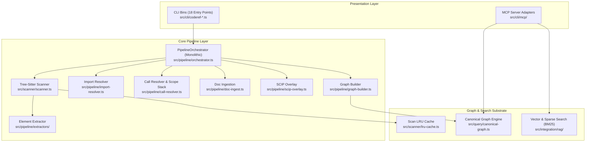

# Current Codebase Architecture Discovery (`coderef-core` AS-IS)

**Audited:** 2026-08-01  
**Project:** `CODEREF-CORE`  
**Files:** 501 source files | 10,133 graph edges  

---

## 1. Executive Discovery Summary

`coderef-core` is a local-first code analysis engine, graph query substrate, and MCP tool server built with TypeScript and Tree-Sitter. It ingests multi-language source trees (TS/JS, Python, Go, Rust, Java, C/C++), extracts AST declarations, resolves imports and function call sites, builds a canonical dependency graph (`.coderef/graph.json`), and surfaces 36+ MCP tools and 18 CLI commands for AI coding agents.

---

## 2. As-Is Component Breakdown & Dependency Topology

---

## 3. Structural Defect & Coupling Analysis

1. **Monolithic Pipeline Orchestrator (`orchestrator.ts`):**
   * **Problem:** 994-line monolithic class fan-out to 15 sub-modules.
   * **Consequence:** `run()` (full scan) and `runIncremental()` duplicate resolution and graph build logic (`assembleAndResolve`). Pipeline steps cannot be tested or swapped independently.

2. **Monolithic Shared MCP Substrate (`src/cli/mcp/shared.ts`):**
   * **Problem:** `shared.ts` exports 26 symbols handling CLI option parsing, auto-build ceilings, timeouts, and graph instantiation across all 7 tool families.
   * **Consequence:** High coupling; a change to graph loading affects all 36 MCP tools.

3. **Scattered Query Invocations:**
   * **Problem:** CLI tools (`coderef-query`, `coderef-analyze`, `coderef-map`) instantiate duplicate graph loading paths and custom AST traversals.
   * **Consequence:** Minor discrepancies in how graph paths, cycle detections, and symbol lookups are computed across CLI commands versus MCP tools.

4. **Mixed Layer Boundaries:**
   * **Problem:** `doc-ingest.ts` and `scip-overlay.ts` are ad-hoc procedural utilities called conditionally inside the orchestrator loop rather than structured pipeline phases.
