# Clean Rebuild Blueprint Architecture Graph & System Specification

## Purpose
Define the clean-slate target architecture and dependency blueprint for rebuilding `coderef-core` from scratch. The objective is to preserve 100% of existing functionality (18 CLI commands, 36+ MCP tools, multi-language Tree-Sitter scanning, RAG search, SCIP overlays) while enforcing strict engineering standards, single responsibility, and a decoupled 6-layer pipeline phase middleware architecture.

---

## Context & As-Is Architecture Summary
Discovery on `CODEREF-CORE` identified 501 files and 10,133 graph edges. Key structural friction areas in the current implementation:
1. **Monolithic Orchestrator (`orchestrator.ts`):** 994-line monolithic class fan-out to 15 sub-modules with duplicated execution paths (`run()` vs `runIncremental()`).
2. **Monolithic MCP Substrate (`shared.ts`):** 26 exported symbols in a single file creating tight coupling across all MCP tools.
3. **Procedural Invocations:** `doc-ingest.ts` and `scip-overlay.ts` invoked as ad-hoc routines rather than standardized pipeline phases.

---

## Target Clean Blueprint Architecture Graph

```mermaid
graph TD
    subgraph Presentation & Adapters Layer [Layer 6]
        CLI_ADAPTER["CLI Runner Suite<br/>@adapters/cli/*<br/>(18 thin CLI adapters)"]
        MCP_ADAPTER["MCP Tool Server Adapters<br/>@adapters/mcp/*<br/>(Graph, Lookup, Map, RAG, Verification)"]
    end

    subgraph Service & Application Layer [Layer 5]
        PIPELINE_MIDDLEWARE["Pipeline Phase Middleware Chain<br/>@application/pipeline/executor.ts"]
        MUTATION_ENGINE["AST Safe Mutation & Refactoring Engine<br/>@application/refactor/ast-mutation.ts"]
        QUERY_SERVICE["Unified Code Intelligence Query Service<br/>@application/services/query-service.ts"]
    end

    subgraph Pipeline Phase Handlers [Layer 4 Middleware]
        PH_DISCOVER["01. FileDiscoveryPhase"]
        PH_CACHE["02. IncrementalCachePhase"]
        PH_SCAN["03. ASTElementScanPhase"]
        PH_IMPORT["04. ImportResolutionPhase"]
        PH_CALL["05. ScopeCallResolutionPhase"]
        PH_SCIP["06. SCIPPrecisionOverlayPhase"]
        PH_DOC["07. DocFactIngestionPhase"]
        PH_GRAPH["08. CanonicalGraphEmissionPhase"]
    end

    subgraph Canonical Domain & Graph Engine [Layer 3]
        CANONICAL_GRAPH["Canonical Graph Engine<br/>@domain/graph/canonical-graph.ts"]
        SYMBOL_TABLE["Global Symbol Table & Scope Stack<br/>@domain/symbol/symbol-table.ts"]
        INDEX_STORAGE["Atomic Graph Index Storage (.coderef/)<br/>@domain/storage/index-storage.ts"]
    end

    subgraph RAG & Search Substrate [Layer 2]
        SPARSE_BM25["BM25 Sub-Token N-Gram Retriever<br/>@infrastructure/search/sparse-bm25.ts"]
        DENSE_VECTOR["Ollama Vector Embeddings<br/>@infrastructure/search/vector-store.ts"]
        RRF_FUSION["Reciprocal Rank Fusion (RRF) Reranker<br/>@infrastructure/search/rrf-fusion.ts"]
    end

    subgraph Core Parser Substrate [Layer 1]
        TREE_SITTER["Tree-Sitter Multi-Language Grammar Registry<br/>@infrastructure/parser/grammar-registry.ts"]
        AST_VISITORS["Language AST Element Visitors<br/>@infrastructure/parser/visitors/*"]
        LRU_CACHE["LRU Scan Disk/Memory Cache<br/>@infrastructure/cache/lru-cache.ts"]
    end

    %% Wiring & Dependencies
    CLI_ADAPTER --> QUERY_SERVICE
    CLI_ADAPTER --> PIPELINE_MIDDLEWARE
    MCP_ADAPTER --> QUERY_SERVICE
    MCP_ADAPTER --> MUTATION_ENGINE

    PIPELINE_MIDDLEWARE --> PH_DISCOVER
    PIPELINE_MIDDLEWARE --> PH_CACHE
    PIPELINE_MIDDLEWARE --> PH_SCAN
    PIPELINE_MIDDLEWARE --> PH_IMPORT
    PIPELINE_MIDDLEWARE --> PH_CALL
    PIPELINE_MIDDLEWARE --> PH_SCIP
    PIPELINE_MIDDLEWARE --> PH_DOC
    PIPELINE_MIDDLEWARE --> PH_GRAPH

    PH_SCAN --> TREE_SITTER
    PH_SCAN --> AST_VISITORS
    PH_SCAN --> LRU_CACHE
    PH_CALL --> SYMBOL_TABLE
    PH_GRAPH --> CANONICAL_GRAPH
    PH_GRAPH --> INDEX_STORAGE

    QUERY_SERVICE --> CANONICAL_GRAPH
    QUERY_SERVICE --> SPARSE_BM25
    QUERY_SERVICE --> DENSE_VECTOR
    SPARSE_BM25 --> RRF_FUSION
    DENSE_VECTOR --> RRF_FUSION
```

---

## Architectural Principles & Standards

1. **Decoupled Phase Middleware Chain:** Standardized `runPhases(context, phaseList)` executor processing `PipelinePhase` modules (`FileDiscoveryPhase`, `ImportResolutionPhase`, `SCIPPrecisionOverlayPhase`, etc.).
2. **Unified `QueryService` Facade:** Single query context serving both CLI entry points and MCP tool servers.
3. **Modular Presentation Adapters:** Disentangled MCP tool modules (`graph-tools.ts`, `lookup-tools.ts`, `search-tools.ts`, `verification-tools.ts`).
4. **Deterministic `PipelineContext`:** Single immutable context object passed sequentially down the phase middleware chain.

---

## Next Step
When ready to promote this planning folder to an active workorder stub, run:
`/stub clean-rebuild-blueprint --category=feature --owner-domain=CODEREF-CORE`
