# CodeRef Ecosystem Topology Architecture Plan (`ecosystem-topology`)

## Purpose
Define the high-level ecosystem topology showing how the **Pure Code Intelligence Engine (`coderef-intel-engine`)** produces low-latency feeds consumed by the **Extracted Downstream Surfaces (`parsed-surfaces`)** and external AI agent platforms.

---

## Unified Ecosystem Topology Graph

```mermaid
graph TD
    subgraph Ecosystem_Feeds ["Standardized Intelligence Feeds"]
        MCP["MCP Server Protocol<br/>(get_graph_data, impact_of, symbol_context)"]
        CLI_STREAM["CLI JSON Streams<br/>(coderef-query, coderef-pipeline)"]
        SSE["Real-Time Watch SSE Event Stream<br/>(element_added, edge_invalidated)"]
    end

    subgraph Pure_Intel_Engine ["Headless Intelligence Engine (Producer)"]
        ENGINE_FACADE["IntelEngineFacade"]
        CANONICAL_GRAPH["Canonical Graph Engine"]
        HYBRID_SEARCH["BM25 N-Gram + Vector Search"]
        MUTATION_ENGINE["AST Safe Mutation Engine"]
    end

    subgraph Extracted_Consumer_Surfaces ["Parsed-Out Consumer Surfaces"]
        MAP_VIEWER["coderef-map-viewer<br/>(Interactive D3/Canvas Map Web App)"]
        DOC_GEN["coderef-doc-gen<br/>(Resource Sheet & Foundation Doc Pipeline)"]
        CONTEXT_PACK["coderef-context-pack<br/>(Token-Budgeted AI Prompt Packager)"]
        STATIC_REPORTS["coderef-exporter<br/>(Static PDF/HTML Change Exporters)"]
    end

    subgraph External_AI_Ecosystem ["External AI Agents & IDEs"]
        CURSOR["Cursor IDE Plugin"]
        CLAUDE["Claude Agent / Antigravity CLI"]
        VSCODE["VS Code Extension"]
        CI_CD["CI/CD Pre-Flight Audit Scripts"]
    end

    %% Internal Engine Component Connections
    ENGINE_FACADE --> CANONICAL_GRAPH
    ENGINE_FACADE --> HYBRID_SEARCH
    ENGINE_FACADE --> MUTATION_ENGINE

    %% Feed Production
    ENGINE_FACADE --> MCP
    ENGINE_FACADE --> CLI_STREAM
    ENGINE_FACADE --> SSE

    %% Consumer Surface Feed Ingestion
    MCP --> MAP_VIEWER
    MCP --> DOC_GEN
    CLI_STREAM --> CONTEXT_PACK
    CLI_STREAM --> STATIC_REPORTS

    %% External Agent Feed Ingestion
    MCP --> CURSOR
    MCP --> CLAUDE
    MCP --> VSCODE
    SSE --> CLAUDE
    CLI_STREAM --> CI_CD
```

---

## Data Flow Protocol

1. **Graph & Symbol Querying:** Consumers send requests via MCP tools (`graph_view`, `symbol_lookup`, `impact_of`). The Intel Engine computes the query on `canonical-graph.ts` and returns lean JSON payloads.
2. **Visual Mapping:** `coderef-map-viewer` fetches `/map/data.json` from the engine's MCP/HTTP server and renders the canvas/D3 map on the user's browser.
3. **Documentation Generation:** `coderef-doc-gen` queries AST elements and semantic headers to generate resource sheets and markdown docs.
4. **Real-Time Deltas:** As developers edit code, `coderef-intel-engine` emits incremental graph delta events over SSE to Cursor, VS Code, and active AI agents.
