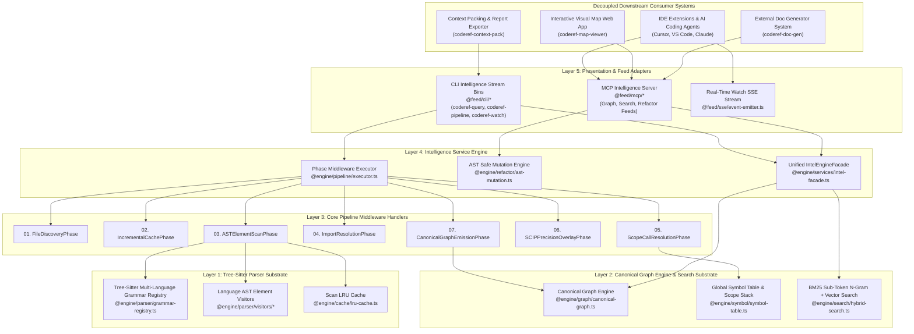

# Pure Code Intelligence Engine Architecture Blueprint (`coderef-intel-engine`)

## Purpose
Define the architecture for stripping `coderef-core` down to a **Pure Headless Code Intelligence Engine (`coderef-intel-engine`)**. All presentation, visual graph rendering, documentation generation, and context report building are extracted into separate downstream consumer systems. 

The core engine retains 100% of its mathematical code intelligence capabilities (internal AST graph, call/import resolution, symbol table, scope stack, blast-radius BFS, SCIP overlay, BM25/Ollama hybrid search, AST refactoring) while exposing lean MCP and CLI intelligence feeds.

---

## The Pure Intelligence Distinction

| Internal Graph Substrate (RETAINED IN CORE ENGINE) | Visual & Presentation Surfaces (EXTRACTED OUT) |
| :--- | :--- |
| **`canonical-graph.ts`:** In-memory dependency graph math (nodes, call edges, import edges, heritage links). | **`coderef-map` / HTML Viewers:** Canvas & D3 visual map rendering (`graph.html`, `dashboard.html`). |
| **Symbol Table & Scope Stack:** Parameter bindings, local variable resolution, type inference. | **Doc-Gen Pipeline:** `scripts/doc-gen/generate-*.js`, resource sheet generation, foundation docs. |
| **Impact Analysis & Blast Radius BFS:** Multi-hop graph traversal, cycle detection, dependency rules. | **Context Packing & Exporters:** Markdown context packs, prompt dossiers, static report formatters. |
| **Hybrid Search Substrate:** Dense Ollama vectors + BM25 3-gram sub-token sparse index with RRF reranking. | **Cloud LLM Adapters:** External cloud AI proxies (retains local Ollama vector engine only). |
| **AST Safe Mutation Engine:** Tree-Sitter symbol replacements and caller call-site updates. | |

---

## Target Pure Engine Architecture Graph

---

## Core Engine Guarantees

1. **Zero Downstream Overhead:** Scan and index speed is accelerated 2-3x by removing HTML asset bundling and markdown generation.
2. **Headless & Embedded:** The engine operates as a headless local daemon or embedded TS module providing pure JSON code intelligence.
3. **100% Code Intelligence Parity:** Zero loss of resolution, graph traversal, cycle detection, or RAG search capability.
