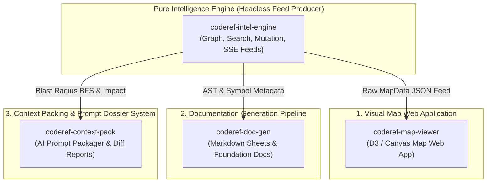

# Extracted Presentation & Downstream Consumer Surfaces Plan (`parsed-surfaces`)

## Purpose
Define the architecture and breakdown for the systems extracted from `coderef-core`. By stripping presentation, visual graph rendering, documentation generation, and context packing out of the core engine, these components become independent downstream consumer projects that subscribe to the `coderef-intel-engine` MCP and CLI feeds.

---

## The 3 Extracted Consumer Systems

---

## Extracted System Specs

### 1. `coderef-map-viewer` (Visual Map Web App & Canvas Renderer)
* **Responsibility:** Standalone Web Application / Local Viewer for visual graph mapping.
* **Consumes:** Emitted `MapData` JSON feed from `coderef-intel-engine`.
* **Features:** D3/Canvas node-link visualizer, zoom/pan controls, dark/light theme switching, layer drift overlays, metrics heatmaps, community clustering, and detail panel.
* **Separation Benefit:** The core engine no longer copies static CSS/JS assets or embeds HTML shells during repo scans.

### 2. `coderef-doc-gen` (Documentation Generation System)
* **Responsibility:** Automated documentation generator and resource-sheet authoring pipeline.
* **Consumes:** AST element facts, semantic headers, and symbol taxonomy from `coderef-intel-engine`.
* **Features:** Generates `coderef/resource-sheets/*.md`, `coderef/foundation-docs/*.md`, and project READMEs.
* **Separation Benefit:** Eliminates `scripts/doc-gen/` from the core engine, allowing doc generators to evolve independently without dirtying the engine scan loop.

### 3. `coderef-context-pack` (Context Packing & Report Exporter)
* **Responsibility:** Token-budgeted AI prompt packager and static change-dossier exporter.
* **Consumes:** Impact BFS, dependency rules, and breaking change deltas from `coderef-intel-engine`.
* **Features:** Bundles multi-file context dossiers for LLM prompts, generates pre-flight change reports, and produces static Markdown exports (`export/`).
* **Separation Benefit:** Keeps the core engine focused purely on graph query computation, leaving prompt formatting and token budgeting to dedicated client wrappers.

---

## Next Steps
When ready to promote this planning folder to a dedicated downstream project stub, run:
`/stub parsed-surfaces --category=feature --owner-domain=CODEREF-CORE`
