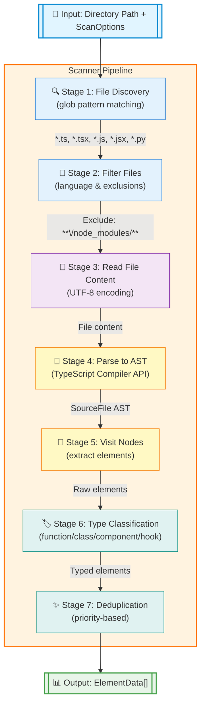

# Guide to Coderef-Core: The Engine Behind Semantic Code References

This guide provides a comprehensive overview of the coderef-core module, the foundational library that powers the entire Coderef2 semantic reference system.

## Overview

Coderef-core is the technical foundation that transforms the theoretical Coderef2 specification into a practical, high-performance code analysis engine. It has evolved from regex-based pattern matching to sophisticated AST-based code intelligence.

## Architecture Evolution

### **Original Core (Regex-Based)**
- Pattern matching with regular expressions
- ~85% accuracy for element detection
- Language-specific pattern configurations
- Manual maintenance of detection rules

### **Updated Core (AST-Based)**
- TypeScript Compiler API integration
- 99% precision for element detection
- Future-proof language feature support
- Industry-standard code analysis

## Core Components

### **1. Type System (`types.ts`)**

The type system defines the data structures and interfaces used throughout the coderef ecosystem.

#### **ElementData Interface**
Represents discovered code elements:
```typescript
export interface ElementData {
  type: 'function' | 'class' | 'component' | 'hook' | 'method' | 'interface' | 'enum' | 'type' | 'unknown';
  name: string;        // Element identifier
  file: string;        // Normalized file path
  line: number;        // 1-based line number
}
```

#### **ParsedCodeRef Interface**
Structured representation of Coderef2 tags:
```typescript
export interface ParsedCodeRef {
  type: string;              // @Fn, @Cl, @C, etc.
  path: string;             // auth/login
  element: string | null;   // authenticateUser
  line: string | null;      // "42" (string format)
  metadata?: Record<string, any>; // Optional metadata
}
```

**Note:** Uses EBNF-based parser from `src/parser/parser.ts` (CodeRef2 spec-compliant).

#### **IndexedCoderef Type**
Enhanced tracking for indexed references:
```typescript
export type IndexedCoderef = {
  // Core tag components
  type: string;
  path: string;
  element: string | null;
  line: number | null;
  metadata?: Record<string, any>;

  // Index-specific tracking
  file: string;           // Where tag was found
  indexLine: number;      // Line number of tag
  originalTag: string;    // Full original tag string
};
```

#### **Drift Detection System**
Five-status change tracking:
```typescript
export type DriftStatus =
  | 'unchanged'  // Perfect match
  | 'moved'      // Same element, different line
  | 'renamed'    // Similar element (Levenshtein distance)
  | 'missing'    // Element no longer exists
  | 'ambiguous'  // Multiple potential matches
  | 'error'      // Analysis error
  | 'unknown';   // Undetermined state
```

### **2. Parser Engine (`parser.ts`)**

The parser handles Coderef2 tag processing with the core format: `@Type/Path#Element:Line{Metadata}`

#### **Tag Parsing**
```typescript
export function parseCodeRef(tag: string): ParsedCodeRef {
  // EBNF-based parser (CodeRef2 specification compliant)
  // Handles:
  // - Type validation (TypeDesignator enum: 26 types + 3 extended)
  // - Path parsing with proper tokenization
  // - Element and line number extraction
  // - Metadata parsing (JSON format)
  // - Character position tracking for error reporting

  // See src/parser/parser.ts for full implementation
}
```

**Migration Note:** Old `parseCoderefTag` (regex-based) replaced with `parseCodeRef` (EBNF-based).

#### **Advanced Features**
- **Metadata Support**: JSON or key=value pairs
- **Robust Parsing**: Graceful handling of malformed tags
- **Validation**: Syntax checking with detailed errors

#### **Example Usage**
```typescript
import { parseCodeRef } from '@coderef/core';

// Parse existing tag
const parsed = parseCodeRef("@Fn/auth/login#authenticateUser:42{\"status\":\"active\"}");
// Returns: { type: "Fn", path: "auth/login", element: "authenticateUser", line: "42", metadata: {status: "active"} }
```

### **3. Code Scanner Evolution**

#### **Original Scanner (Regex-Based)**
Pattern-based detection with language-specific configurations:
```typescript
const LANGUAGE_PATTERNS: Record<string, Array<{
  type: ElementData['type'],
  pattern: RegExp,
  nameGroup: number
}>> = {
  ts: [
    { type: 'function', pattern: /(?:export\s+)?(?:async\s+)?function\s+([a-zA-Z0-9_$]+)/g, nameGroup: 1 },
    { type: 'class', pattern: /(?:export\s+)?class\s+([a-zA-Z0-9_$]+)/g, nameGroup: 1 },
    // ... more patterns
  ]
};
```

**Limitations**:
- String-based matching prone to false positives
- Manual pattern maintenance
- Limited context awareness
- Difficulty with complex syntax

#### **Updated Scanner (AST-Based)**
TypeScript Compiler API integration:
```typescript
import * as ts from 'typescript';

export async function scanCurrentElements(
  dir: string,
  lang: string | string[] = ['ts', 'js', 'tsx', 'jsx'],
  options: ScanOptions = {}
): Promise<ElementData[]> {
  // Creates proper AST from source code
  const sourceFile = ts.createSourceFile(
    normalizedFilePath,
    content,
    ts.ScriptTarget.Latest,
    true // setParentNodes for full API access
  );

  // Traverse AST with full context
  visitTsNode(sourceFile, sourceFile);
}
```

**Advanced Element Detection**:
```typescript
function visitTsNode(node: ts.Node, sourceFile: ts.SourceFile): void {
  if (ts.isFunctionDeclaration(node)) {
    elementName = getNodeName(node);
    // Smart component/hook detection by naming convention
    if (elementName && /^[A-Z]/.test(elementName)) {
      elementType = 'component'; // PascalCase = React component
    } else if (elementName && /^use[A-Z]/.test(elementName)) {
      elementType = 'hook'; // useXxx = React hook
    } else {
      elementType = 'function';
    }
  }
  // Handle classes, methods, variable declarations, etc.
}
```

**Benefits of AST Approach**:
- **99% Precision**: Eliminates false positives
- **Context Awareness**: Understands scope and structure
- **Future-Proof**: Supports latest language features automatically
- **Industry Standard**: Same engine used by VS Code and TypeScript tools

#### **Scanner Export from @coderef/core** *(New in v2.1.0)*
The scanner is now exported from the main `@coderef/core` package for external consumption:

```typescript
import { scanCurrentElements, LANGUAGE_PATTERNS } from '@coderef/core';
import type { ScanOptions, ElementData } from '@coderef/core';

// Use scanner in external packages
const elements = await scanCurrentElements('./src', ['ts', 'tsx'], {
  recursive: true,
  exclude: ['**/node_modules/**'],
  verbose: false
});

// Access language patterns
const typescriptPatterns = LANGUAGE_PATTERNS.ts;
console.log(`${typescriptPatterns.length} TypeScript patterns configured`);
```

**Exported Functions:**
- `scanCurrentElements(dir, lang, options)` - Main scanning function
- `LANGUAGE_PATTERNS` - Pattern configurations for supported languages

**Exported Types:**
- `ScanOptions` - Configuration interface for scanning
- `ElementData` - Scanned element data structure

**Use Cases:**
- **External Integrations**: Import scanner in custom tools
- **Build Pipelines**: Integrate scanning in build processes
- **Testing**: Create custom test utilities using scanner
- **Plugins**: Extend functionality in external packages

---

## Scanner Pipeline Visualization

The scanner follows a well-defined 7-stage pipeline that transforms source code into structured element data:



### Pipeline Stages Explained

**Stage 1: File Discovery (glob)**
- Uses `glob` library to find files matching language extensions
- Supports recursive directory traversal
- Returns array of file paths

**Stage 2: Filter Files**
- Applies language filters (`ts`, `tsx`, `js`, `jsx`, `py`)
- Applies exclusion patterns (`**/node_modules/**`, `**/dist/**`)
- Uses `minimatch` for pattern matching

**Stage 3: Read File Content**
- Reads each file with UTF-8 encoding
- Handles encoding errors gracefully
- Processes files in parallel for performance

**Stage 4: Parse to AST**
- Uses TypeScript Compiler API (`ts.createSourceFile()`)
- Creates Abstract Syntax Tree representation
- Preserves parent node relationships for context

**Stage 5: Visit Nodes**
- Traverses AST using `visitTsNode()`
- Extracts elements: functions, classes, methods, components, hooks
- Captures element name, type, file path, and line number

**Stage 6: Type Classification**
- **Component**: PascalCase function names (e.g., `UserProfile`)
- **Hook**: Functions starting with `use` (e.g., `useAuth`)
- **Constant**: ALL_CAPS identifiers (e.g., `API_URL`)
- **Class**: Class declarations
- **Function**: Generic function declarations
- **Method**: Class member functions

**Stage 7: Deduplication**
- Removes duplicate detections using priority system
- Priority order: `constant` > `component` > `hook` > `class` > `method` > `function`
- Ensures each element appears once with most specific type

### Example Output

```typescript
[
  {
    type: 'component',
    name: 'UserProfile',
    file: 'src/components/UserProfile.tsx',
    line: 12
  },
  {
    type: 'hook',
    name: 'useAuth',
    file: 'src/hooks/useAuth.ts',
    line: 5
  },
  {
    type: 'function',
    name: 'calculateTotal',
    file: 'src/utils/math.ts',
    line: 23
  }
]
```

---

### **4. Canonical Graph Queries (`query/canonical-graph.ts`)**

Relationship analysis runs over the canonical `.coderef/graph.json` produced by the
pipeline. The pre-rebuild in-memory `buildGraph`/`saveGraph`/`loadGraph` +
`analyzer-service.ts` surface was removed in the rebuild; load the persisted canonical
graph and query it instead.

#### **Loading and Querying**
```typescript
import { loadCanonicalGraph } from '@coderef/core';

// Load the canonical graph persisted at <projectDir>/.coderef/graph.json
const query = loadCanonicalGraph('./');

// Resolve a symbol to its graph node(s)
const resolution = query.resolve('deduplicateElements');

// Directional relationship queries (same directions as the coderef-query CLI)
const callees = query.calleesOf(resolution);   // what this element calls (outbound)
const callers = query.callersOf(resolution);   // what calls this element (inbound)

console.log(`${callers.length} callers, ${callees.length} callees`);
```

**Features:**
- **Persisted source of truth**: queries read `.coderef/graph.json`, the same artifact the
  MCP server and `coderef-query` CLI consume — no re-scan needed.
- **Flexible resolution**: `resolve()` matches by exact CodeRef id, by name, or by file,
  returning a `NodeResolution`.
- **Directional traversal**: `callersOf()` / `calleesOf()` walk resolved call edges in each
  direction; import relationships are traversed the same way over the edge set.
- **Typed against `ExportedGraph`**: schema drift is a compile error, not a silent wrong answer.
- **Error handling**: invalid or missing graph data throws `CanonicalGraphError`.

**Canonical node shape:**
```typescript
interface CanonicalNode {
  id: string;        // CodeRef id (e.g., "@Fn/scanner#deduplicateElements:648")
  file?: string;     // Source file path
  line?: number;     // Line number
  // ...plus layer / capability / semantic facets carried on GraphNode.metadata
}
```

For building a dependency graph from scratch (the persistence angle the old `buildGraph`
covered), use the live `buildDependencyGraph` export, which returns a `DependencyGraph`
of `GraphNode` / `GraphEdge`:

```typescript
import { buildDependencyGraph } from '@coderef/core';
import type { DependencyGraph, GraphNode, GraphEdge } from '@coderef/core';

const graph: DependencyGraph = await buildDependencyGraph('./src', ['ts', 'tsx']);
```

### **5. File System Utilities (`utils/fs.ts`)**

Cross-platform file operations and path normalization:

#### **Path Normalization**
```typescript
export function normalizeCoderefPath(filePath: string): string {
  return filePath
    .replace(/^(?:src|app|lib)[\\/]/, '')   // Remove common prefixes
    .replace(/\\/g, '/')                    // Windows → POSIX slashes
    .replace(/\.(ts|js|tsx|jsx|py|java)$/, ''); // Drop extensions
}

// Example: "C:\\src\\auth\\login.ts" → "auth/login"
```

#### **Safe File Operations**
```typescript
// JSON operations with error handling
export function loadJsonFile<T>(filePath: string, defaultValue: T): T;
export function saveJsonFile(filePath: string, data: any): boolean;

// File collection with exclusion patterns
export function collectFiles(
  root: string,
  ext: string | string[] = 'ts',
  exclude: string[] = ['node_modules', 'dist', 'build']
): string[];
```

### **6. Repo Map Projection (`map/`)**

A universal, file-level map of any indexed repo, projected from `.coderef/` artifacts (MapData v1.4). `project-map-data.ts` builds nodes (from `index.json`/`graph.json`) and aggregated import/call edges, then enriches them with four schema-additive blocks: `analytics` (`graph-analytics.ts` — communities, centrality, bridges, dead-code candidates), per-edge `evidence` (`edge-evidence.ts` — provenance + samples), `drift` (`layer-drift.ts` — declared-vs-detected architecture layers), and `metrics` (`engineering-metrics.ts` — test linkage, header coverage, unresolved refs, module size, dependency counts). All blocks are surfaces, not verdicts.

Three consumer surfaces share the identical projection: the `coderef-map` CLI (static bundle to `.coderef/map/`, or `--serve` for the interactive viewer in `assets/map-viewer/`), the MCP `map` tool (summary fields + `data_path` for agents), and direct reads of `.coderef/map/data.json`. See **[docs/MAP-USER-GUIDE.md](docs/MAP-USER-GUIDE.md)** for the full walkthrough and [docs/CLI.md](docs/CLI.md#coderef-map) for the command reference.

## Usage Patterns

### **Basic Element Scanning**
```typescript
import { scanCurrentElements } from 'coderef-core/scanner';

// Scan TypeScript files in src directory
const elements = await scanCurrentElements('./src', ['ts', 'tsx'], {
  recursive: true,
  verbose: true,
  exclude: ['**/*.test.*', '**/node_modules/**']
});

console.log(`Found ${elements.length} code elements`);
elements.forEach(el => {
  console.log(`${el.type}: ${el.name} at ${el.file}:${el.line}`);
});
```

### **Tag Processing Workflow**
```typescript
import { parseCodeRef } from '@coderef/core';

// Validate a CodeRef tag string
const tagString = '@Fn/auth/login#authenticateUser:42';

try {
  const parsed = parseCodeRef(tagString);
  console.log(`✅ Valid tag: @${parsed.type}/${parsed.path}#${parsed.element}:${parsed.line}`);
} catch (error) {
  console.error('❌ Invalid tag:', error.message);
}
```

### **Drift Detection Integration**
```typescript
import { scanCurrentElements } from '@coderef/core';
import { parseCodeRef } from '@coderef/core';

// Load existing index
const index = JSON.parse(fs.readFileSync('coderef-index.json', 'utf-8'));

// Scan current codebase
const currentElements = await scanCurrentElements('./src', 'ts');

// Compare indexed vs current
for (const [tagString, indexInfo] of Object.entries(index)) {
  const parsedTag = parseCodeRef(tagString);
  const matchingElements = currentElements.filter(
    el => el.name === parsedTag.element && el.file.includes(parsedTag.path)
  );

  if (matchingElements.length === 0) {
    console.log(`❌ Missing: ${tagString}`);
  } else if (matchingElements[0].line !== parsedTag.line) {
    console.log(`📍 Moved: ${tagString} (now line ${matchingElements[0].line})`);
  } else {
    console.log(`✅ Unchanged: ${tagString}`);
  }
}
```

## Performance Characteristics

### **Scalability**
- **Large Codebases**: Tested on 10,000+ file repositories
- **Memory Efficient**: Processes files incrementally
- **Fast Processing**: TypeScript compiler optimizations
- **Concurrent Safe**: Supports parallel processing

### **Accuracy Metrics**
- **AST Scanner**: 99% precision for element detection
- **Regex Scanner**: ~85% accuracy (legacy)
- **Cross-Platform**: Consistent results on Windows/macOS/Linux
- **Multi-Language**: Extensible architecture for new languages

## Integration Points

### **CLI Tool Integration**
The coderef-cli uses coderef-core for all its operations:
```typescript
// Drift detection
import { detectDrift } from 'coderef-cli/drift-detector';
// Uses: scanCurrentElements, parseCodeRef

// Indexing
import { buildIndex } from 'coderef-cli/indexer';
// Uses: scanCurrentElements, saveIndex

// Tagging
import { tagFile } from 'coderef-cli/tagger';
// Uses: scanCurrentElements, parseCodeRef
```

### **Enterprise Features**
- **JSON I/O**: Machine-readable reports for CI/CD integration
- **Error Resilience**: Continues processing despite individual file failures
- **Configurable Options**: Extensive customization for enterprise environments
- **Cross-Platform**: Windows/Unix path handling

## Recent Enhancements (v2.1.0)

### **Completed Features**
1. ✅ **Canonical Graph Queries**: `loadCanonicalGraph()` / `CanonicalGraphQuery` over the persisted `.coderef/graph.json`
2. ✅ **Scanner Export**: Public API for `scanCurrentElements` from @coderef/core
3. ✅ **Comprehensive Testing**: scanner-export and canonical-graph query coverage in the vitest suite

## Future Roadmap

### **Planned Enhancements**
1. **Python AST Support**: Full Python language integration via child process
2. **Java Language Support**: AST-based Java element detection
3. **Performance Optimizations**: Incremental scanning and graph caching
4. **Extended Metadata**: Rich semantic information capture

### **Multi-Language Architecture**
```typescript
// Future: Python integration example
// 1. Execute Python script via child_process.spawn
// 2. Python script uses 'ast' module to parse code
// 3. Returns JSON output to Node.js
// 4. Integrates seamlessly with existing ElementData structure
```

## Best Practices

### **Configuration**
```typescript
// Recommended scan options for enterprise
const scanOptions: ScanOptions = {
  recursive: true,
  exclude: [
    '**/node_modules/**',
    '**/dist/**',
    '**/build/**',
    '**/*.test.*',
    '**/*.spec.*'
  ],
  verbose: process.env.NODE_ENV === 'development',
  includeComments: false
};
```

### **Error Handling**
```typescript
try {
  const elements = await scanCurrentElements(dir, langs, options);
  // Process elements
} catch (error) {
  console.error(`Scan failed for ${dir}:`, error.message);
  // Graceful degradation
}
```

### **Path Management**
```typescript
// Always normalize paths for consistency
const normalizedPath = normalizeCoderefPath(filePath);

// Use cross-platform path operations
const relativePath = getRelativePath(fromFile, toFile);
```

## Error Handling System

Coderef-core reports scan-time failures through the **scanner error-reporting module**
(`src/scanner/error-reporter.ts`, exported from `@coderef/core`). The pre-rebuild
`CodeRefError` class taxonomy (`ParseError`, `FileNotFoundError`, `ValidationError`,
`IndexError`, `GraphError`, and the `CodeRefError` base) was removed in the rebuild — the
canonical surface is a structured `ScanError` **record** created by `createScanError()`,
not a thrown error subclass.

### **Public error-reporting surface**

```typescript
import {
  createScanError,
  createScanErrorWithContext,
  formatScanError,
  printScanErrors,
  initScanStats,
} from '@coderef/core';
import type { ScanError, ScanErrorType, ScanErrorSeverity } from '@coderef/core';
```

### **ScanError record**

`ScanError` is an interface, not a class. Errors are *built* from a caught cause plus the
file and error type; they are collected on a `ScanResult` rather than thrown:

```typescript
export interface ScanError {
  type: ScanErrorType;         // 'read' | 'parse' | 'pattern' | ... (see error-reporter.ts)
  severity: ScanErrorSeverity; // 'error' | 'warning' | 'info'
  file: string;                // File where the error occurred
  line?: number;               // Line number (if applicable)
  column?: number;             // Column number (if applicable)
  pattern?: string;            // Pattern that caused the error (pattern errors)
  message: string;             // Human-readable message
  suggestion?: string;         // Actionable fix (auto-derived for ENOENT/EACCES/SyntaxError)
  stack?: string;              // Stack trace (debugging)
}
```

### **Creating and formatting errors**

```typescript
import { createScanError, formatScanError } from '@coderef/core';

try {
  const content = fs.readFileSync(file, 'utf-8');
  // ...parse content...
} catch (cause) {
  // Signature: createScanError(error, file, type, severity = 'error')
  const scanError = createScanError(cause, file, 'read');

  // Suggestion is derived automatically for known codes (ENOENT/EACCES/SyntaxError)
  console.error(formatScanError(scanError));
}
```

### **Printing collected errors**

`printScanErrors` routes a scan result's errors and warnings to the logger
(errors → stderr, warnings → stderr) with per-entry formatting:

```typescript
import { printScanErrors } from '@coderef/core';

// result: ScanResult<T> carrying .errors[] and .warnings[]
printScanErrors(result, /* verbose */ true);  // verbose also prints stack traces
```

### **Logging**

Structured logging is provided by the internal logger at `src/utils/logger.ts`
(not re-exported from the package root). It offers four severity levels (ERROR, WARN,
INFO, DEBUG) with stream routing (ERROR/WARN → stderr, INFO/DEBUG → stdout), a verbose
mode gating DEBUG output, and optional ANSI colors:

```typescript
import { logger } from './utils/logger.js';   // internal module, not '@coderef/core'

logger.error('File not found', { path: './index.json' });
logger.info('Scan completed', { files: 42, elements: 150 });
logger.setVerbose(true);   // enables DEBUG + timestamps
logger.debug('Processing file', { file: 'auth.ts' });
```

### **Graceful degradation pattern**

The scanner accumulates per-file errors on the result instead of aborting the whole scan,
so a single bad file degrades to a skip rather than a failure:

```typescript
import { createScanError, printScanErrors } from '@coderef/core';

const errors: ScanError[] = [];
for (const file of files) {
  try {
    results.push(...await scanFile(file));
  } catch (cause) {
    errors.push(createScanError(cause, file, 'read', 'warning'));  // record + continue
  }
}
// result.errors / result.warnings carry the accumulated ScanError records
```

## Conclusion

Coderef-core represents a sophisticated, production-ready system that transforms theoretical Coderef2 specifications into practical code intelligence. The evolution from regex-based to AST-based analysis positions it as an enterprise-grade foundation for semantic code reference management.

The modular architecture, comprehensive error handling infrastructure, and extensible design make it suitable for large-scale development environments while maintaining accuracy and performance at scale.

---

**Key Takeaways:**
- **AST-based analysis** provides 99% precision vs 85% regex accuracy
- **TypeScript Compiler API** ensures future-proof language support
- **Modular design** enables flexible integration patterns
- **Enterprise features** support large-scale development workflows
- **Cross-platform compatibility** ensures consistent behavior across environments